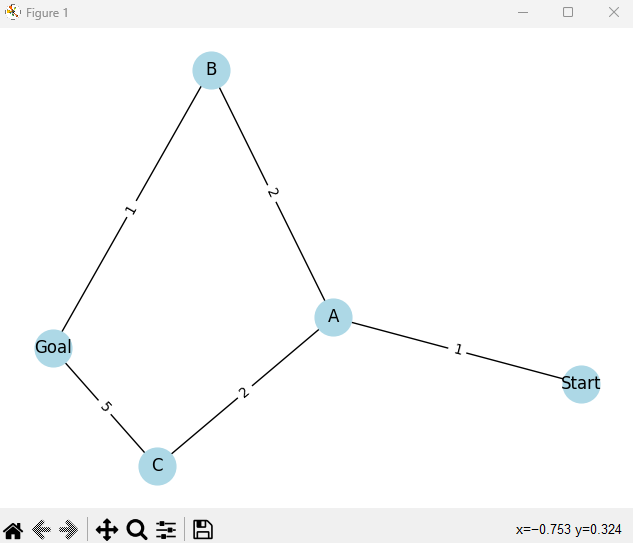
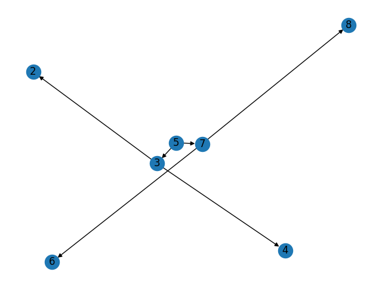

# Final Self-Assessment in Data Structures and Algorithms

## Personal Details

- **Name:** Fadi Helal
- **Student ID:** 2312951

## Table of Contents

1. [Introduction](#introduction)
2. [Skills Overview](#skills-overview)
3. [Learning Journey](#learning-journey)
4. [Future Objectives](#future-objectives)
5. [Conclusion](#conclusion)
6. [Appendix: Visualizations](#appendix-visualizations)

## Introduction

This document encapsulates my reflective journey and acquired proficiency in data structures and algorithms, marking the culmination of an insightful course. 
It underscores the synergy between theoretical concepts and their practical applications, particularly in the robotics and automation sectors where 
I actively contribute.

## Skills Overview

### Strengthened Skills

- **Advanced Data Structures:** Enhanced practical understanding of graphs and trees, leading to more efficient problem-solving strategies in projects. [See Appendix for visualization](#appendix-visualizations).
- **Algorithmic Optimization:** Successfully implemented optimized pathfinding algorithms, significantly improving the performance of robotic navigation systems.

### Areas for Improvement

- **Dynamic Programming:** Recognized as an area needing more practice to fully grasp and apply its concepts effectively.
- **Graph Algorithms:** Plan to deepen understanding and application in future projects.

## Learning Journey

The course facilitated a robust bridge between my existing knowledge and the intricate world of algorithms and data structures. 
A highlight was the development of an algorithm that markedly improved the efficiency of automation solutions, showcasing the impactful 
integration of theory and practice.

### Key Projects

- **Robotic Navigation Optimization:** Developed and applied an advanced pathfinding algorithm, enhancing operational efficiency. 
[See Appendix for details](#appendix-visualizations).

## Future Objectives

- **Mastering Complex Algorithms:** Focus on conquering dynamic programming and advanced graph algorithms.
- **AI/ML Integration:** Explore how advanced data structures can be synergized with AI/ML algorithms to pioneer innovative solutions in 
automation and robotics.

## Conclusion

This course has been a pivotal milestone in my professional development, significantly enhancing my capabilities and broadening 
my perspectives on solving complex problems through advanced data structures and algorithms. The journey ahead is filled with 
opportunities for deeper exploration and mastery in this ever-evolving field.

## Appendix: Visualizations

### Project Visualization

- 

### Data Structure Example

- 